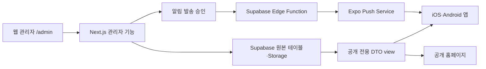

# 쥬빌리워십 모바일 앱 개발 기획서

- 문서 버전: 1.6
- 최초 작성일: 2026-08-14 KST
- 최종 현행화일: 2026-08-24 KST
- 대상 플랫폼: iOS, Android
- 현재 단계: 스토어 심사 제출 직전을 위한 운영 자격 증명·서명 빌드·실기기 검수 준비
- 확정 디자인: `Light · Dark v9 · 앱 내부 텍스트 중심`; 런처 아이콘은 공식 로고, 시작 화면은 로고 없는 추상 자산 사용
- 기준 목업: [라이트](../design/mobile/output/app-design-board-v9-light.png), [다크](../design/mobile/output/app-design-board-v9-dark.png)
- 기능 기준: [모바일 디자인 설명](../design/mobile/README.md), [송리스트 기능 명세](../design/mobile/SONGLIST_SPEC.md), [설교·말씀 기능 명세](../design/mobile/SERMON_SPEC.md)

### 확정된 운영 결정

1. 관리자 웹에는 공개 회원가입을 두지 않는다. `owner`가 등록·초대한 이메일 계정만 접속할 수 있다.
2. 신규 관리자는 기본 `editor`로 승인하며, `owner`만 관리자 승인·비활성화, 콘텐츠 최종 공개와 푸시 발송을 수행한다.
3. 모든 관리자 등록과 추가 `owner` 승격은 기존 `owner`가 건별로 수동 승인하며 자동 승격 기능은 두지 않는다.
4. 1차 송리스트 듣기 링크는 승인된 공식 YouTube 영상·재생목록만 허용한다.
5. 앱 내부 화면은 `쥬빌리워십` 텍스트 중심 구성을 유지한다. 2026-08-20 후속 결정에 따라 휴대전화 런처 아이콘에는 공식 쥬빌리워십 로고를 사용하고, 시작 화면은 타사 로고·인물·상징이 없는 추상 자산과 한글 제목을 사용한다.
6. 1차 개발 완료 기준은 Expo/EAS 검증본을 iOS·Android에서 설치·회귀 검증하고, 스토어 제출 직전의 외부 연동·정책·서명 게이트를 명확히 분리하는 것으로 한다. 실제 스토어 제출은 별도 승인 후 수행한다.
7. 알림 데이터는 최소수집 원칙에 따라 토큰 원문 24시간, 180일 미활동 설치 비활성화, 비활성 정보 30일, 발송 상세기록 90일, 매일 자동 정리 기준을 적용한다.
8. Google Play 개인 개발자 계정은 2025년에 등록했으므로 정식 공개 전에 12명·14일 연속 비공개 테스트와 Production access 신청을 별도 출시 게이트로 둔다.

## 1. 개요

쥬빌리워십 앱은 예배 참석자가 다음 예배, 설교 주제와 말씀 구절, 일정 변경 공지, 이번 주 송리스트, 공식 예배 영상과 오시는 길을 로그인 없이 확인하는 공개 앱이다. 콘텐츠는 별도 앱 관리자 기능으로 중복 관리하지 않고, 기존 웹 관리자 `/admin`에서 작성·검수·게시한다.

앱은 Supabase의 공개 전용 데이터 화면(view)만 읽는다. 웹 관리자가 게시한 내용은 데이터베이스를 거쳐 홈페이지와 앱에 함께 반영한다. 긴급 일정 변경, 취소, 송리스트 공개 알림은 관리자가 최종 발송을 확인한 뒤 푸시 알림으로 전달한다.

## 2. 개발 목표

1. 확정 목업의 `홈 · 예배 · 미디어 · 안내` 4개 탭과 송리스트 상세 화면을 iOS·Android 앱으로 구현한다.
2. 웹 관리자에서 일정, 설교 주제·말씀 구절, 공지, 송리스트, 영상, 사진, 안내 문구와 공개 상태를 수정할 수 있게 한다.
3. 앱 사용자에게 초안이나 승인 전 콘텐츠가 노출되지 않도록 공개 범위와 권한을 데이터베이스에서 강제한다.
4. 일정 변경·취소, 송리스트 공개·변경, 선택한 예배의 전날 19:30과 당일 1시간 전 알림을 제공한다.
5. 로그인과 회원정보 수집 없이 필요한 기능을 제공하고, 오프라인에서도 마지막으로 확인한 일정과 공지를 볼 수 있게 한다.
6. 관리자 웹은 `owner`가 승인한 등록 이메일 계정에만 개방하고 역할에 따라 작성·공개 권한을 분리한다.

## 3. 현재 상태와 신규 개발 범위

| 구분 | 현재 확인된 상태 | 이번 개발 범위 |
|---|---|---|
| 앱 디자인 | v9 라이트·다크 6화면, 홈·예배 설교 정보, 정식 홈 예배 사진과 공식 런처 로고 반영 | 실제 네이티브 화면·시작 자산·접근성 반영 완료 |
| 모바일 앱 | Expo 기반 iOS·Android 공통 앱, 라이트·다크 저장, 4개 탭·상세 화면 구현 | 실제 APNs·FCM, 운영 서명, 스토어 빌드 검증 |
| 웹 공개 사이트 | 공개 페이지와 로컬 QA 완료 | 앱과 동일 데이터 사용 여부 회귀검증 |
| 웹 관리자 | 기존 관리 기능과 설교·송리스트·갤러리·안내·관리자 승인 기능 구현 | 법적 문서·푸시 발송 최종 연동과 운영 메일 검증 |
| 데이터베이스 | 앱 공개 view, 설교·송리스트 승인 흐름, RLS·Storage 정책 구현, 동의 v5까지 원격 migration 21/21개 적용·fail-closed 재검증 | 최초 owner·최종 정책 원문·운영 데이터 및 실제 만료정보 삭제 검증 |
| 공통 규칙 | 앱 DTO, 날짜·D-Day·YouTube·송리스트 검증 규칙 구현 | 푸시 요청·응답 계약 최종 검증 |
| 운영 연결 | Free `쥬빌리` Supabase 저장소 link·Edge Function 8개·retention cron, Vercel Production 연결, 외부 push 비활성 | Firebase·APNs, 서명 빌드, 실제 push, TestFlight·Play 내부 테스트 연결 |

현재 원격 Supabase 백엔드와 EAS 세 환경의 Supabase 공개 URL·publishable key, Vercel Production 웹과 서버 secret은 연결됐다. 다만 Firebase/FCM·APNs, 운영 서명 빌드·스토어 내부 테스트는 아직 연결되지 않았다. 최신 실행 증거와 미완료 gate는 `docs/QA_REPORT.md`와 `docs/DEPLOYMENT_CHECKLIST.md`를 준거로 한다.

현재 관리자 로그인은 이메일·비밀번호 인증 후 활성 `admin_users` 등록 여부를 다시 확인하며, 공개 가입도 차단돼 있다. 오너 전용 관리자 초대·비활성화 화면, 초대 수락·비밀번호 설정 경로, `owner/editor` 권한 분리도 구현됐다. 실제 메일 송수신 검증은 운영 Supabase·SMTP와 최초 오너 정보를 연결하는 단계에서 진행한다.

## 4. 서비스 구조



### 데이터 반영 원칙

- 관리자는 웹에서 초안 작성, 검수, 공개를 진행한다.
- 앱은 원본 테이블이 아닌 공개 전용 view만 읽는다.
- 앱을 다시 열거나 당겨서 새로고침하면 최신 공개 내용을 조회한다.
- 마지막 정상 조회 결과는 기기에 보관해 네트워크 장애 시 표시한다.
- 긴급 내용도 저장과 동시에 자동 발송하지 않는다. 관리자가 알림 내용과 대상을 다시 확인한 뒤 발송한다.

## 5. 앱 기능 기획

### 5.1 공통 구성

- 하단 메뉴: `홈 · 예배 · 미디어 · 안내` 4개
- 그래픽 로고는 앱 내부 화면에 사용하지 않고 일반 서체의 `쥬빌리워십` 텍스트만 사용
- 송리스트는 별도 탭이 아니라 예배에 연결된 상세 화면
- 설교 주제와 말씀 구절은 별도 탭을 만들지 않고 다음 예배 카드와 예배 카드 안에 표시
- 상단 종 버튼은 공개 공지·일정 변경·송리스트 공개 내역을 모은 `알림함`으로 연결
- 새로고침, 로딩, 빈 상태, 오류, 오프라인 상태를 모든 데이터 화면에 제공
- 앱 화면 링크를 공유하거나 푸시 알림을 누르면 해당 예배·송리스트 화면으로 이동

### 5.2 화면별 기능과 관리자 연결

| 앱 화면 | 사용자 기능 | 웹 관리자에서 수정할 내용 | 구현 상태 |
|---|---|---|---|
| 시작 화면 | 네이티브 공통 아이콘 후 저장된 라이트·다크 전체화면 배경과 정확한 `쥬빌리워십` 텍스트 표시 | 앱 이름은 고정, 배경은 앱 배포 자산 | 구현·네이티브 검증 완료 |
| 홈 | 다음 예배, D-Day, 장소, 설교 주제·말씀 구절, 중요 공지, 송리스트 1~3곡, 캘린더, 길찾기, 알림함 진입 | Hero 문구·사진, 일정, 설교 정보, 공지, 송리스트 | 일부 기존·일부 신규 |
| 예배 메인 | 다가오는 예배·지난 예배, 예정·변경·취소 상태, 설교 주제·말씀 구절, 상세 정보 | 일정명, 날짜·시간, 장소, 주소, 상태, 설명, 사진, 설교 정보, 공개 여부 | 관리자 일부 기존·일부 신규 |
| 송리스트 상세 | 예배별 곡 순서, 곡명, 아티스트, 공식 듣기 링크, 공유 | 예배 선택, 곡 등록·순서·링크, 확정·변경·공개 | 전체 신규 |
| 미디어 | 검증된 공식 YouTube 영상 재생·외부 열기·공유, 제목 검색, 예배 사진 | 영상, 썸네일, 설명, 날짜, 추천·정렬, 갤러리 사진 | 영상 기존·갤러리 신규 |
| 안내 | 소개, 주소, 지도 앱 연결, 주차·교통, 공식 Instagram, 알림 설정, 개인정보 처리방침 | 소개·안내 문구, 이미지, 공식 링크, 개인정보 문서 | 일부 기존·일부 신규 |
| 알림함 | 현재 유효한 중요 공지, 일정 변경·취소, 송리스트 공개·변경 내역과 관련 화면 이동 | 공지, 일정 상태, 송리스트 공개, 알림 캠페인 | 전체 신규 화면 |

### 5.3 네이티브 기능

| 기능 | 동작 원칙 |
|---|---|
| 캘린더 추가 | 시스템 일정 추가 화면을 열고 사용자가 직접 저장을 확정한다. iOS 16에서는 시스템 제약으로 일정 추가 전 캘린더 권한을 요청하지만, 앱 코드는 기존 일정을 조회하거나 서버로 전송하지 않는다. iOS 17 이상과 Android에서는 시스템 일정 작성 화면만 연다. |
| 길찾기 | 네이버 지도·카카오 지도·기본 지도 중 설치 가능한 앱 또는 웹 링크로 연결 |
| 공유 | 예배·송리스트·영상의 웹 주소 또는 앱 딥링크를 기기 공유창으로 전달 |
| 영상 | 앱이 음원이나 영상을 내려받지 않고 승인된 공식 링크만 재생·외부 열기 |
| 알림 | 사용자가 설명 화면에서 직접 동의한 경우에만 기기 토큰 등록 |
| 알림함 | 공개 콘텐츠를 시간순으로 표시하고 읽음 여부는 회원계정 없이 기기에만 저장 |
| 오프라인 | 마지막 정상 일정·설교 정보·공지·송리스트·안내를 표시하고 `마지막 업데이트` 시각 안내 |

딥링크 스킴은 동시 설치 검수를 위해 development=`jubileeworship-dev`, preview=`jubileeworship-preview`, production=`jubileeworship`으로 분리한다. 운영 알림에 저장된 production 링크를 development·preview 시험 기기에서 열 때는 앱이 허용된 화면만 검증한 후 현재 변형의 스킴으로 정규화한다.

### 5.4 설교·말씀 정보

- 홈의 다음 예배 카드에는 `이번 예배 말씀`으로 설교 주제와 말씀 구절을 한 줄씩 표시한다.
- 예배 화면에는 일시·장소·주소 다음, 송리스트 링크 앞에 같은 정보를 표시한다.
- 1차 앱의 말씀 구절은 성경 번역문 전문이 아니라 관리자가 확인한 성경책·장·절 표기다.
- 공개된 설교 정보가 없으면 `이번 예배 말씀을 준비하고 있습니다`를 표시한다.
- 취소된 예배에는 설교 영역을 표시하지 않는다.
- 지난 예배에는 당시 공개된 설교 정보가 유지된다.
- 공개 후 수정할 때는 새 개정본을 만들고, 오너가 승인할 때까지 기존 공개본을 유지한다.

## 6. 송리스트 기능

### 사용자 기능

- 홈에서 이번 주 송리스트의 1~3번 곡 확인
- `전체 보기` 또는 예배 메인의 `이번 주 워십 송리스트`에서 상세 진입
- 곡 순서, 곡명, 아티스트·원곡 정보 확인
- 승인된 경우 곡별 공식 듣기 링크 열기
- 전체 재생목록 링크가 있는 경우 `전체 듣기` 제공
- 송리스트 공유 및 변경 여부 확인

### 관리자 기능

- 예배 일정을 선택해 송리스트 생성
- 곡 추가·삭제, 순서 변경, 곡명·아티스트 입력
- 곡별 공식 링크와 전체 재생목록 링크 입력
- 작업 중인 개정본을 미리보기한 뒤 `검수 완료 → 공개` 실행
- 공개본을 수정할 때는 새 개정본을 만들고, 새 버전이 공개될 때까지 기존 공개본 유지
- 첫 공개는 `확정`, 두 번째 이상 공개는 `변경` 상태와 수정 시각 표시
- 송리스트 공개·변경 알림 초안 생성

### 공개 제한

- `초안`, `미공개` 상태는 앱과 공개 웹에서 조회할 수 없다.
- 가사 전문, 악보 파일, 음원 파일은 앱에서 직접 제공하지 않는다.
- 공식 링크는 허용된 도메인과 관리자 확인 기록이 있는 주소만 공개한다.
- 1차 허용 대상은 YouTube의 공식 영상과 공식 재생목록으로 한정한다. YouTube Music·Spotify·Apple Music 등은 권리와 운영 기준을 별도로 확정한 뒤 추가한다.
- 실제 곡 정보가 없으면 예시 문구 대신 `이번 주 송리스트를 준비하고 있습니다`를 표시한다.

## 7. 알림 기능

### 사용자 선택 항목

- 예배 전날 19:30 알림
- 예배 당일 1시간 전 알림
- 일정 변경·연기·취소 알림
- 송리스트 공개·변경 알림
- 전체 알림 끄기와 기기 등록 해제

### 관리자 발송 흐름

1. 일정·공지·송리스트 내용을 먼저 저장하고 공개한다.
2. `알림 보내기`에서 제목, 본문, 연결 화면, 대상을 확인한다.
3. 테스트 기기로 시험 발송한다.
4. `owner` 권한 관리자가 최종 발송을 승인한다.
5. 발송 결과는 `대기 · 제공자 접수 · 실패` 수준으로 기록한다.
6. Expo receipt에서 `DeviceNotRegistered`가 확인된 토큰은 비활성화한다.

푸시 수신은 앱 사용의 필수조건으로 두지 않는다. 푸시 알림에는 민감정보나 개인별 내용을 넣지 않는다.

정기 예배 알림은 오너가 공개된 `scheduled|postponed` 예배를 선택하고 전날·당일 두 문구를 한 번에 확인해 승인한다. 데이터베이스는 전날 19:30 KST와 당일 1시간 전의 `scheduled_for`를 저장한다. 예배 시각·공개 상태·승인 문구 기준이 바뀌면 기존 예약을 재계산하지 않고 `requires_reapproval`로 표시해 오너 재승인을 강제한다. 실제 발송은 외부 scheduler가 승인된 예약을 `scheduled_for`부터 15분 안에 queue하고 worker가 처리한다. 유효 시간을 넘긴 알림은 늦게 발송하지 않는다.

## 8. 웹 관리자 기능 기획

### 기존 기능 재사용

- 예배 일정 관리
- 공지·일정 변경·취소 관리
- 공식 YouTube 영상 관리
- 교역자 정보 관리
- 홈·소개 문구, 페이지 이미지, SEO 관리
- 승인 이미지 Storage 업로드

### 기존 일정 화면 확장

- `예배 일정 관리` 안에 별도 `설교 정보` 영역을 추가한다.
- `editor`는 설교 주제와 말씀 구절의 초안 저장·검수 요청을 수행한다.
- `owner`는 실제 자료와 본문 표기를 확인하고 미리보기 후 건별로 공개·교체·철회한다.
- 설교 정보 공개는 일정 저장과 분리해, 이미 공개된 예배를 편집하는 동안 초안이 사용자에게 노출되지 않게 한다.

### 신규 메뉴

| 메뉴 | 주요 기능 | 권장 권한 |
|---|---|---|
| 송리스트 관리 | 예배 연결, 개정본별 곡 CRUD, 순서 변경, 미리보기, 검수·공개 | editor 작성, owner 공개 |
| 갤러리 관리 | 사진, 대체텍스트, 촬영일, 설명, 정렬, 공개 동의 확인 | editor 작성, owner 공개 |
| 안내 콘텐츠 | 주차·교통·첫 방문 안내 관리 | editor 작성, owner 공개 |
| 법적 문서 | 개인정보 처리방침의 버전·시행일·공개본 관리 | owner만 공개 |
| 알림 발송 | 캠페인 초안, 테스트 발송, 대상·딥링크 확인, 발송 이력 | owner만 최종 발송 |
| 관리자 관리 | owner·editor 역할, 활성화·비활성화, 최근 작업 확인 | owner만 |

### 관리자 등록·승인 흐름

1. 공개 관리자 회원가입 화면은 제공하지 않는다.
2. `owner`가 `관리자 관리`에서 이메일과 표시 이름을 입력해 초대한다. 신규 계정은 항상 `editor`로 시작한다.
3. 신뢰할 수 있는 서버에서만 Supabase Auth Admin API의 `inviteUserByEmail()`을 호출한다.
4. 초대 응답의 Auth UUID를 `admin_users.user_id`에 연결하고 승인자·승인 시각을 기록한다.
5. 초대받은 사람이 등록 이메일로 전달된 1회성 링크를 열어 `/auth/confirm`에서 초대를 확인한 뒤 `/admin/set-password`에서 비밀번호를 설정한다.
6. 로그인할 때마다 유효한 Supabase 세션과 활성 `admin_users` 등록 여부를 모두 확인한다.
7. 미등록·초대 만료·비활성 계정은 로그인에 성공했더라도 즉시 로그아웃하고 관리자 화면 접근을 차단한다.
8. 초대가 만료되면 오너가 같은 관리자 화면에서 재발송한다.
9. 오너가 계정을 비활성화하면 데이터베이스 권한을 즉시 차단하고 Auth 계정을 장기 정지한다. 기존 접근 토큰이 만료 전 남아 있더라도 데이터베이스 정책은 비활성 계정의 읽기·쓰기를 거부한다.
10. 마지막 활성 `owner`는 본인을 비활성화하거나 `editor`로 내릴 수 없게 하여 관리자 복구 불능 상태를 방지한다.

초대 링크 발송과 비밀번호 복구를 운영에서 사용하려면 전용 SMTP를 연결해야 한다. Supabase 기본 메일 발송기는 운영용이 아니며 수신 주소와 발송량 제한이 있으므로 출시 환경에서는 사용하지 않는다.

최초 오너 이메일과 SMTP 발신 주소는 개발 착수 정보가 아니다. 초대 기능을 구현·로컬 검증한 뒤 운영 Supabase와 도메인을 연결하는 단계에서 입력한다.

### 권한 구분

- `editor`: 일정·공지·영상·송리스트·사진·안내 콘텐츠의 초안 작성과 수정
- `owner`: 공개 승인, 푸시 발송, 공식 링크 승인, 개인정보 문서 공개, 관리자 계정 관리
- 화면에서 버튼만 숨기지 않고 데이터베이스 정책과 Server Action에서 동일 권한을 강제한다.
- 단체명·공식 채널·주소·전화 같은 검증된 공식 정보는 일반 편집 대상에서 제외하고, 재검증과 감사 기록을 거친 `owner` 전용 변경 절차로 제한한다.
- `admin_users`에는 승인자·승인 시각·최근 변경 시각을 기록하고, 활성 오너만 전체 목록·초대·비활성화를 수행할 수 있게 한다.

## 9. 데이터 설계

### 기존 테이블 재사용

- `site_settings`
- `events`
- `announcements`
- `media_items`
- `team_members`
- `admin_users`
- `storage.objects`의 `public-media` 버킷

### 신규 테이블

| 테이블 | 핵심 내용 | 공개 여부 |
|---|---|---|
| `event_sermon_revisions` | 예배별 개정 번호, 설교 주제, 말씀 구절, `draft·review_requested·published·withdrawn`, 검수·공개 기록 | 현재 공개 개정본의 두 표시 필드만 `public_events`에 결합 |
| `event_setlists` | 예배별 개정 번호, `draft·review_requested·published·withdrawn`, 전체 재생목록, 확인·공개 기록 | 예배별 현재 공개 개정본만 제공 |
| `setlist_items` | 송리스트 개정본별 순서, 곡명, 아티스트, KEY, 공식 링크, 확인 기록 | 현재 공개 개정본의 항목만 제공 |
| `gallery_items` | 사진 경로, 대체텍스트, 설명, 촬영일, 정렬, 동의 확인 | 게시된 항목만 제공 |
| `guide_sections` | 주차·교통·첫 방문 안내, 정렬, 공개 상태 | 게시된 항목만 제공 |
| `legal_documents` | 개인정보 처리방침 버전, 시행일, 공개본 | 현재 시행 중인 공개본만 제공 |
| `private.app_installations` | 무작위 설치 ID, 비밀값 hash, 플랫폼, 앱 버전, 마지막 확인 시각 | Data API 비공개 |
| `private.notification_subscriptions` | 설치별 예배·송리스트·공지 알림 선택 | Data API 비공개 |
| `private.push_endpoints` | 설치별 Expo push token과 활성 상태 | Data API 비공개 |
| `private.notification_campaigns` | 알림 문구, 대상, 딥링크, 승인자, 발송 상태 | Data API 비공개 |
| `private.notification_outbox` | 발송 대기 작업과 중복 방지 키 | Data API 비공개 |
| `private.notification_deliveries` | ticket·receipt 결과, 재시도, 오류 코드 | Data API 비공개 |

### 신규 공개 view

- `public_event_setlists`
- `public_setlist_items`
- `public_gallery_items`
- `public_guide_sections`
- `public_legal_documents`

신규 공개 객체는 `anon`에 필요한 `SELECT`만 명시적으로 부여한다. 원본 테이블, 기기 토큰, 관리자 UUID, 감사 열은 공개하지 않는다. view는 `security_invoker`를 사용하고 원본 테이블에는 RLS를 적용한다.

`public_events`에는 현재 공개된 설교 개정본의 `sermon_topic`, `scripture_reference`만 추가한다. 설교 초안, 상태 변경 기록, 검수자와 공개자 UUID는 공개하지 않는다.

### 설교 정보 공개 트랜잭션

`publish_event_sermon_revision()` 데이터베이스 함수가 다음 작업을 한 번에 처리한다.

1. 설교 주제와 말씀 구절이 모두 입력됐는지 검증한다.
2. 호출자가 활성 `owner`인지 다시 확인한다.
3. 기존 공개 개정본을 철회하고 새 개정본을 공개한다.
4. 개정 번호, 공개자와 공개 시각을 기록한다.

중간 단계가 실패하면 전체 작업을 취소한다. 실제 설교 정보를 받기 전에는 production seed에 가상의 설교 주제나 말씀 구절을 넣지 않는다.

### 송리스트 공개 트랜잭션

`publish_setlist_revision()` 데이터베이스 함수가 다음 작업을 한 번에 처리한다.

1. 곡 순서 중복, 빈 제목, 승인되지 않은 링크를 검증한다.
2. 대상 개정본을 공개 상태로 변경한다.
3. `event_setlists.current_published_revision_id`를 새 개정본으로 교체한다.
4. 두 번째 이상 공개라면 앱 표시 상태를 `변경`으로 계산한다.
5. 선택적으로 알림 outbox에 중복 방지 키와 함께 발송 후보를 1건 생성한다.

중간 단계가 실패하면 전체 작업을 취소해 일부 곡만 노출되는 상황을 방지한다. 실제 곡 정보를 아직 받지 않은 개발·운영 환경에는 가상의 곡명을 production seed로 넣지 않는다.

### 공식 YouTube 영상 승인

기존 영상 관리 구조는 사전 승인된 영상만 공개하므로, 신규 영상까지 웹 관리자에서 처리하려면 `owner` 전용 승인 기능을 추가한다. 서버가 YouTube Data API의 `videos.list(part=snippet)`로 영상의 `snippet.channelId`를 조회하고, 등록된 공식 채널 ID와 정확히 일치할 때만 검증 기록과 공개 권한을 부여한다. YouTube API key와 검증용 secret은 앱이나 브라우저에 전달하지 않는다.

송리스트의 곡 링크도 `youtube.com`과 `youtu.be` 형식만 허용하고, `owner`가 해당 아티스트·제작자의 공식 영상 또는 공식 재생목록임을 확인한 기록이 있는 주소만 공개한다.

## 10. 기술 구성

### 모바일

- 개발 착수일의 Expo 최신 안정판을 사용하고, 해당 버전의 iOS·Android 요구사항을 잠근 뒤 작업
- React Native + TypeScript strict
- Expo Router: 파일 기반 화면, 4개 탭, 송리스트 상세, 딥링크
- `expo-notifications`: 토큰·수신·알림 클릭 처리
- `expo-calendar`: 캘린더 저장
- `expo-sharing`, `expo-linking`: 공유·외부 앱 연결
- `expo-secure-store`: 설치 비밀값 등 민감한 로컬 값 보관
- `@supabase/supabase-js`: 공개 DTO 조회
- `@jubilee/domain`: 날짜, D-Day, 공개 상태, URL·DTO 검증 공유

### 무가입 설치 식별

- 앱 화면에는 회원가입·로그인을 두지 않는다.
- 첫 알림 신청 시 공개 Edge Function이 무작위 설치 ID와 충분히 긴 일회성 비밀값을 발급한다.
- 기기에는 설치 ID와 비밀값을 `expo-secure-store`에 보관하고, 서버에는 비밀값 원문이 아닌 hash만 저장한다.
- 토큰 등록·알림 설정 변경·해지는 Edge Function이 설치 비밀값을 검증한 뒤 수행한다.
- 설치 등록 API에는 요청 제한, push token 형식 검증, 중복·재발급 정책을 적용한다.
- 푸시 관련 private 테이블에는 앱 publishable key의 직접 접근 권한을 부여하지 않는다.

### 웹·서버

- 기존 Next.js 16 관리자 유지
- Supabase Postgres, Auth, Storage, Edge Functions 사용
- 관리자 초대·비활성화용 `requireOwner()` 검사와 서버 전용 Supabase Admin client 추가
- `SUPABASE_SECRET_KEY`는 Vercel·서버 환경변수에만 저장하고 `NEXT_PUBLIC_` 접두사를 사용하지 않음
- 푸시 발송용 Expo access token은 Edge Function secret에만 저장
- 앱과 웹 브라우저에는 publishable key만 포함하고 service role·secret key는 포함하지 않음

### 권장 모바일 폴더 구조

```text
apps/mobile/
  src/app/
    _layout.tsx
    (tabs)/
      _layout.tsx
      index.tsx
      worship/index.tsx
      media/index.tsx
      guide/index.tsx
    worship/[slug]/index.tsx
    worship/[slug]/songlist.tsx
    notifications/index.tsx
  src/components/
  src/features/
  src/lib/content/
  src/lib/notifications/
  src/lib/cache/
  assets/
  app.config.ts
  eas.json
```

송리스트 상세는 `(tabs)` 밖에 두어 확정 디자인처럼 하단 탭 없이 표시한다.

## 11. 보안·개인정보 원칙

- 일반 사용자는 로그인하지 않는다.
- 이름, 이메일, 전화번호, 위치정보를 수집하지 않는다.
- 지도는 외부 지도 링크를 열며 사용자 위치 권한을 요구하지 않는다.
- 알림 동의 시 Supabase는 무작위 설치 ID, 재사용할 수 없도록 해시한 설치 검증값, Expo 푸시 토큰·해시, 플랫폼·앱 버전·앱 구분, 선택한 알림 종류, 동의 버전·고지문 해시·언어·시각, 만 14세 이상 확인·시각, 최종 연결 시각, 알림 제목·본문·딥링크, 대상 종류·관련 예배 일정, 발송 승인·대기 상태, 설치별 발송 시도, Expo 티켓·영수증, 전달·오류 상태를 저장·처리한다. Expo는 토큰 발급·갱신을 위해 운영체제 기기 푸시 토큰과 Expo 앱 설치·프로젝트·앱 식별정보를 처리하며, 실제 발송 때 Expo·Apple·Google은 운영체제 기기 푸시 토큰, 앱 식별정보, 알림 제목·본문·딥링크와 전달 메타데이터를 처리한다. 공급자별 목적·보관·삭제 절차를 개인정보처리방침에 구분해 명시한다.
- 앱과 홈페이지의 운영주체는 `쥬빌리 워십`, 문의·개인정보 이메일은 `sundoojubileeworship@gmail.com`으로 표시한다.
- 알림 해제·무효 판정 후 푸시 토큰 원문은 최대 24시간 이내 삭제한다.
- 180일 동안 활동이 확인되지 않은 설치는 비활성화하고, 30일 동안 재등록하지 않으면 설치 식별정보를 삭제한다.
- 발송 상세기록은 90일이 경과한 항목을 다음 일일 cleanup에서 삭제하며, 작업 지연·적체 시 실제 삭제는 다음 정상 실행 이후 완료될 수 있다.
- 예배 알림 선택은 종교적 관심을 추론할 수 있는 정보로 보수적으로 취급하고, 이름·이메일·광고 식별자와 결합하거나 광고·추적·프로파일링에 사용하지 않는다.
- 관리자 인증·RLS·최소 GRANT·감사 trigger는 기존 원칙을 유지한다.
- `owner`와 `editor`의 실제 권한 차이를 DB와 서버 양쪽에서 검사한다.
- 관리자 권한은 사용자가 수정 가능한 `user_metadata`나 이메일 문자열만으로 판단하지 않고, `admin_users`의 활성 상태와 역할을 기준으로 판단한다.
- Supabase secret key는 관리자 초대용 서버 코드에서만 사용하며 브라우저와 모바일 앱에는 전달하지 않는다.
- 새 테이블은 기본 비공개로 생성하고 필요한 공개 view에만 명시적 권한을 부여한다.
- 푸시 토큰과 설치 비밀값은 공개 view, 관리자 일반 목록, 오류 응답과 로그에 포함하지 않는다.

## 12. 비기능 요구사항

| 항목 | 기준 |
|---|---|
| 접근성 | VoiceOver·TalkBack 라벨, 동적 글자 크기, 색 대비, 44pt 이상 터치 영역 |
| 시간 | 모든 일정 표시와 D-Day 계산은 `Asia/Seoul` 기준 |
| 성능 | 정상 네트워크에서 첫 화면의 핵심 일정이 3초 안에 보이도록 목표 설정 |
| 오프라인 | 마지막 정상 콘텐츠와 업데이트 시각 표시, 쓰기 기능은 없음 |
| 안정성 | 빈 데이터·잘못된 링크·네트워크 오류가 앱 종료로 이어지지 않음 |
| 콘텐츠 정확성 | 초안·만료 공지·취소 예배의 노출 규칙을 DB와 앱에서 이중 확인 |
| 이미지 | 공식 승인 이미지, 대체텍스트, 권리·인물 동의 확인 기록 사용 |
| 로그 | 토큰·비밀번호·관리자 UUID·개인정보를 앱 로그와 오류 로그에 남기지 않음 |

## 13. 개발 단계와 예상 일정

아래 일정은 1인 개발자가 주요 업무를 전담한다는 가정의 잠정치다. 계정 발급, 외부 승인, 스토어 심사 기간은 제외한다.

| 단계 | 기간 | 주요 산출물 | 완료 기준 |
|---|---:|---|---|
| 1. 기반 구성 | 1주 | `apps/mobile`, Expo Router, 공통 테마·컴포넌트, 환경 분리 | iOS·Android 개발 빌드에서 4개 탭 표시 |
| 2. 데이터 계약 | 1.25주 | 설교·송리스트·갤러리·안내·알림 migration, domain schema, 공개 view | migration reset, RLS·GRANT 테스트 통과 |
| 3. 핵심 앱 화면 | 1.5주 | 홈, 예배, 설교 정보, 송리스트, 미디어, 안내, 캐시·오류 상태 | 목업과 주요 흐름 일치, 공개 DTO 실데이터 표시 |
| 4. 웹 관리자 확장 | 1.75주 | 설교·송리스트·갤러리·안내·권한 관리 | 관리자 수정·공개 후 앱 반영 확인 |
| 5. 알림·네이티브 기능 | 1주 | 푸시, 딥링크, 캘린더, 공유, 지도 | 테스트 단말 수신과 해당 화면 이동 확인 |
| 6. 통합 QA·베타 | 1주 | 자동 테스트, 실기기 점검, TestFlight·Play 내부 테스트 | 출시 후보 체크리스트 통과 |
| 7. Play 정식 공개 자격 | 외부 일정 | 12명 이상 비공개 테스트 14일 연속 운영, Production access 신청 | Google 승인 후 정식 공개 가능 |

예상 개발 기간은 약 7~8주이며, 실제 기간은 운영 계정과 콘텐츠 제공 시점에 따라 조정한다.

## 14. 테스트 계획

### 자동 테스트

- domain: DTO, 날짜, D-Day, 설교 주제·말씀 구절, 송리스트 순서·상태, 링크 허용 규칙
- DB: RLS, 열 권한, 설교·송리스트 초안 비노출, 공개본 원자적 교체, 역할 분리, 중복 알림 방지, 토큰 접근 차단
- 웹: 관리자 CRUD, 공개 승인, 이미지 업로드, 알림 발송 확인창
- 앱: 화면 상태, 딥링크, 오프라인 캐시, 링크·공유 처리

### 핵심 통합 시나리오

- `editor`가 송리스트 새 개정본을 편집하는 동안 앱에는 기존 공개본이 그대로 보인다.
- `editor`가 설교 정보 새 개정본을 편집하는 동안 앱에는 기존 공개본이 그대로 보인다.
- 설교 주제 또는 말씀 구절 한쪽만 있는 개정본은 공개할 수 없고, 취소 예배에는 설교 영역이 표시되지 않는다.
- `owner`가 공개하면 앱에 새 개정본 전체가 한 번에 보이고, 변경 알림 후보는 1건만 생성된다.
- 공개 전 송리스트·사진·안내와 승인 전 공식 링크는 익명 조회 결과가 0건이다.
- `editor`는 게시·철회·삭제·푸시 발송·법적 문서 공개를 직접 수행할 수 없다.
- 공개 회원가입과 미등록 이메일 로그인을 차단하고, 오너 초대·수락·만료·재발송·비활성화 흐름을 검증한다.
- 대소문자만 다른 중복 이메일 초대와 `editor`의 관리자 승인 시도를 차단한다.
- 마지막 활성 `owner` 비활성화·강등과 자기 권한 상승을 차단한다.
- 신규 관리자와 추가 `owner`가 자동 승인되는 경로가 없고, 기존 `owner`의 건별 수동 승인 기록이 남는지 확인한다.
- 푸시 토큰은 공개 DTO, 관리자 일반 API, 오류 응답, 서버 로그에서 조회되지 않는다.
- 송리스트가 없으면 홈에 가상 곡명 대신 준비 중 상태가 표시된다.

### 실기기 테스트

- iPhone 실기기와 Google Play Services가 있는 Android 실기기에서 확인
- 알림 허용·거부·재허용, 앱 종료 상태 알림 진입
- 예배 캘린더 추가, 네이버·카카오·기본 지도 연결
- 큰 글자, VoiceOver·TalkBack, 작은 화면, 느린 네트워크, 오프라인
- 앱 업데이트 후 기존 기기 토큰·설정·캐시 유지 여부

## 15. 1차 출시 완료 기준

- 로그인 없이 홈 첫 화면에서 다음 예배와 변경 여부를 확인할 수 있다.
- 홈에서 이번 주 송리스트 1~3곡, 두 번 이내 조작으로 전체 송리스트를 확인할 수 있다.
- 홈과 예배 화면에서 동일한 공개 설교 주제와 말씀 구절을 확인할 수 있다.
- 관리자가 웹에서 공개한 일정·설교 정보·공지·송리스트·영상·사진·안내가 앱에 반영된다.
- 오너가 초대한 등록 이메일은 관리자 웹에 접속할 수 있고, 미등록·비활성 이메일은 접속할 수 없다.
- 초안, 만료 공지, 승인되지 않은 링크와 영상은 앱에 노출되지 않는다.
- 일정 변경·취소와 송리스트 알림을 테스트 기기에서 받고 해당 화면으로 이동한다.
- 캘린더, 공유, 지도 연결이 iOS·Android 실기기에서 동작한다.
- 오프라인에서 마지막 일정·공지·송리스트를 확인할 수 있다.
- DB 정책 테스트, 웹 테스트, 앱 테스트, 실기기 핵심 흐름 검증이 모두 통과한다.
- TestFlight와 Google Play 내부 테스트 설치본을 제공한다.

스토어 정식 공개는 위 개발 완료와 별도로 앱 아이콘, 스토어 설명·스크린샷, 개인정보 공개, 개발자 계정, 서명, 최종 사용자 승인이 필요하다. Google Play는 2025년에 만든 개인 개발자 계정이므로 12명 이상이 14일 연속 참여한 비공개 테스트와 Production access 승인을 추가로 완료해야 한다.

## 16. 1차 제외 범위

- 일반 사용자 로그인·회원 프로필
- 댓글·채팅·커뮤니티·기도제목 접수
- 헌금·후원·결제
- 가사 전문·악보·음원 파일 직접 제공
- 성경 번역문 전문·설교 원고·설교 음성 파일 직접 제공
- 자체 라이브 스트리밍
- 사용자 사진·파일 업로드
- 출석·QR·포인트
- 사용자 위치 추적
- 앱 내부 관리자 기능

## 17. 착수 전·출시 전 확인 항목

### 개발 착수 전

- 앱 표시 이름, iOS bundle ID, Android package name
- 공식 쥬빌리워십 로고 설치 아이콘 `app-icon-official.png`와 Android 적응형·단색 아이콘 안전영역
- Expo/EAS 프로젝트와 Apple·Google 개발자 계정 담당자
- 송리스트 공식 YouTube 링크를 확인할 담당 `owner`
- 설교 주제와 말씀 구절을 확인·공개할 담당 `owner`
- 푸시 알림 최종 발송 권한을 가진 `owner`

### 베타·출시 전

- 일상 개발·reset·seed·CI는 로컬 Supabase에서만 수행하고, 생성된 Free `쥬빌리` 원격 프로젝트 하나는 통합검수 후 초기 운영으로 승격
- Vercel Preview에는 Supabase 서버 secret을 두지 않고, Production 서버에만 trusted 환경변수로 제공
- 최초 관리자 계정과 복구 담당자
- 운영 Supabase 공개 가입 차단, Site URL과 초대·복구 redirect URL 허용 목록
- 개인정보처리방침·이용약관 최종 원문과 시행일 owner 승인
- 확정 운영주체 `쥬빌리 워십`과 문의·개인정보 이메일 `sundoojubileeworship@gmail.com` 반영 확인
- 웹 공식 도메인 및 앱 딥링크 연결 도메인
- APNs·FCM·EAS 자격 증명
- 관리자 초대·비밀번호 복구용 운영 SMTP와 발신 주소
- 실제 예배·송리스트·영상·안내 콘텐츠 최종 검수

## 18. 공식 기술 근거

- [Expo Router 소개](https://docs.expo.dev/router/introduction/)
- [Expo Router 화면 이동·딥링크](https://docs.expo.dev/router/basics/navigation/)
- [Expo Notifications](https://docs.expo.dev/versions/latest/sdk/notifications/)
- [Expo Calendar](https://docs.expo.dev/versions/latest/sdk/calendar/)
- [Expo Sharing](https://docs.expo.dev/versions/latest/sdk/sharing/)
- [Expo SecureStore](https://docs.expo.dev/versions/latest/sdk/securestore/)
- [Supabase Edge Functions 푸시 알림 예제](https://supabase.com/docs/guides/functions/examples/push-notifications)
- [Supabase Data API 보안](https://supabase.com/docs/guides/api/securing-your-api)
- [Supabase Row Level Security](https://supabase.com/docs/guides/database/postgres/row-level-security)
- [Supabase 사용자 초대](https://supabase.com/docs/guides/auth/users#inviting-users)
- [Supabase 운영용 SMTP](https://supabase.com/docs/guides/auth/auth-smtp)
- [YouTube Data API videos.list](https://developers.google.com/youtube/v3/docs/videos/list)
- [Apple App Review Guidelines](https://developer.apple.com/app-store/review/guidelines/)
- [Google Play 내부 테스트](https://support.google.com/googleplay/android-developer/answer/9845334)
- [Google Play 개인 계정 비공개 테스트·Production access](https://support.google.com/googleplay/android-developer/answer/14151465)
- [Expo 내부 배포](https://docs.expo.dev/build/internal-distribution/)

## 19. 결론

본 개발의 핵심은 앱 화면을 별도로 만드는 것뿐 아니라, 기존 웹 관리자를 단일 콘텐츠 관리 도구로 확장하는 것이다. 일정·공지·영상·사이트 설정은 기존 구현을 재사용하고, 송리스트·갤러리·안내 콘텐츠·푸시·역할 분리를 신규 개발한다. 모바일 앱은 공개 전용 view를 읽는 구조로 구현해 관리자 데이터와 앱 표시가 일치하도록 한다.
